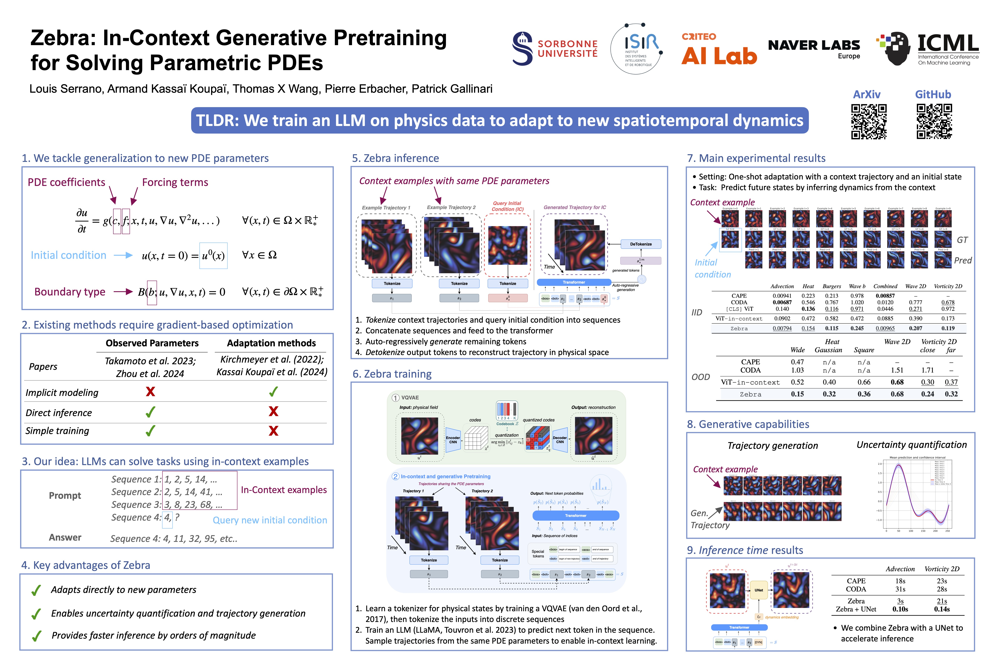

# 1. Official Code
Official PyTorch implementation of Zebra | [Accepted at ICML 2025](https://openreview.net/forum?id=22kNOkkokU))


<p float="center">
  
</p>

To cite our work:

```
inproceedings{
serrano2025zebra,
title={Zebra: In-Context Generative Pretraining for Solving Parametric {PDE}s},
author={Louis Serrano and Armand Kassa{\"\i} Koupa{\"\i} and Thomas X Wang and Pierre ERBACHER and Patrick Gallinari},
booktitle={Forty-second International Conference on Machine Learning},
year={2025},
url={https://openreview.net/forum?id=22kNOkkokU}
}
```

# 1. Code installation and setup
## zebra installation
```
conda create -n zebra python=3.9.0
pip install -e .
```

## setup wandb config example

add to your `~/.bashrc`
```
export WANDB_API_TOKEN=your_key
export WANDB_DIR=your_dir
export WANDB_CACHE_DIR=your_cache_dir
export MINICONDA_PATH=your_anaconda_path
```

# 2. Data

We will shortly push the datasets used in this paper on HuggingFace (https://huggingface.co/sogeeking) and provide scripts to **download** them directly from there in the folder `download_dataset`.

# 3. Run experiments 

The code runs only on GPU. We provide sbatch configuration files to run the training scripts. They are located in `bash` and are organized by datasets.
We expect the user to have wandb installed in its environment for monitoring. 
In Zebra, the first step is to launch an tokenizer.py training, in order to learn a finite vocabulary of physical phenomena. The weights of the tokenizer model are automatically saved under its `run_name`.
For the second step, i.e. for training the language model with an in-context pretraining, we need to use the previous `run_name` as input to the config file to load the tokenizer model. The `run_name` can be set in the config file, but can also be generated randomly by default with wandb.

For instance, for `advection` we need to first train the VQVAE:
`sbatch bash/burgers/tokenizer.sh`
and then once we specified the correct run_name in the config:
`sbatch bash/burgers/llama.sh`

# Acknowledgements

This project would not have been possible without these awesome repositories:
* Transformer implementation from hugging face: https://github.com/huggingface/transformers
* MAGVIT implementation from lucidrains: https://github.com/lucidrains/magvit2-pytorch
* PDE Arena : https://github.com/pdearena/pdearena


